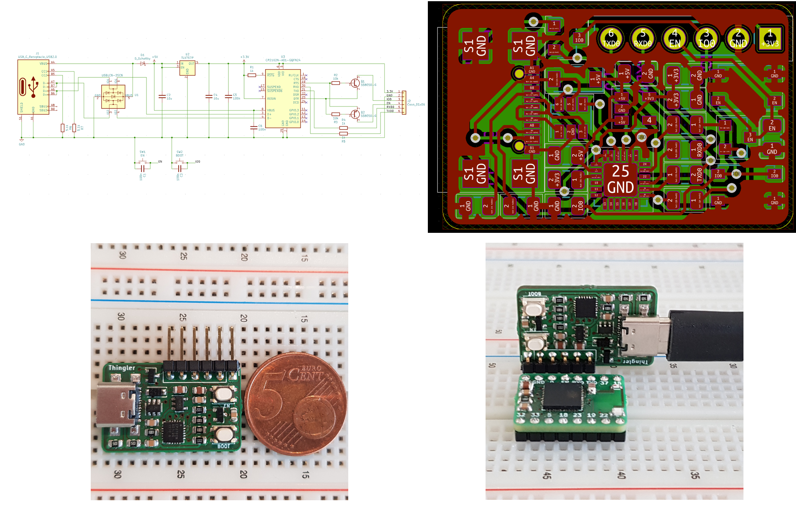

# Thingler ESP32 Programmer

Thingler ESP32 Programmer is a USB Type-C to UART ESP32 programmer. The programmer is based on the CP2102N chip with two tactile buttons, BOOT and EN. The programmer can also be used to power the ESP32 (3.3V) chip and read log data sent from the ESP32 chip.

Thingler ESP32 Programmer has been designed for the [Thingler ESP32-PICO-D4 Module](https://github.com/thingler/esp32-pico-d4-module) but can be used to program any ESP32 chip.

Thingler ESP32 Programmer schematics and PCB has been designed with KiCad.

## Getting started

### Requirements

* Follow Espressif Systems [Getting started](https://docs.espressif.com/projects/esp-idf/en/latest/esp32/get-started/) instructions

* [Silicon Labs drivers](https://www.silabs.com/products/development-tools/software/usb-to-uart-bridge-vcp-drivers) in case the programmer is not recognized by the computer

* [KiCad](https://kicad-pcb.org/download/) for the schematics

### Build

The PCB wihout components can be ordered from [Aisler](https://aisler.net/p/ZDSBSTHE) or the PCB can be ordered from any fabrication houses by providing the [gerber files](Gerbers).

The following components has been used for the programmer:

| Ref | Qty | Manufacturer Part Number | Manufacturer | Description | Product Link |
| --- | --- | --- | --- | --- | --- |
| J1 | 1 | USB4110-GF-A | GCT | CONN USB 2.0 TYPE-C R/A SMT | [Digi-Key](https://www.digikey.fi/product-detail/en/gct/USB4110-GF-A/2073-USB4110-GF-A-1-ND/10384548) |
| J2 | 1 | 61300611021 | Wurth Elektronik | Headers & Wire Housings WR-PHD 2.54mm Hdr 6P Single RA Gold | [Mouser](https://www.mouser.fi/ProductDetail/Wurth-Elektronik/61300611021?qs=sGAEpiMZZMs%252BGHln7q6pm%2FFhW%252BtWvhAgF9O0k379tgrIAU3f9uJjqw%3D%3D) |
| U1 | 1 | USBLC6-2SC6 | STMicroelectronics | ESD Protection Low Cap | [Mouser](https://www.mouser.fi/ProductDetail/STMicroelectronics/USBLC6-2SC6?qs=sGAEpiMZZMvxHShE6Whpu%2FcIE2H5IOBdvREMGHqn6h0=) |
| U2 | 1 | TLV75733PDBVR | Texas Instruments | LDO Voltage Regulators 1-A | [Mouser](https://www.mouser.fi/ProductDetail/Texas-Instruments/TLV75733PDBVR?qs=sGAEpiMZZMsGz1a6aV8DcD1rpA6FsR3JV0%2FewXLxMYU%3D) |
| U3 | 1 | CP2102N-A02-GQFN24 | Silicon Labs | USB Interface IC USB to UART bridge | [Mouser](https://www.mouser.fi/ProductDetail/Silicon-Labs/CP2102N-A02-GQFN24?qs=sGAEpiMZZMve4%2FbfQkoj%252BP31zB%2FHBbi56Ndgs5ozdaU%3D) |
| SW1, SW2 | 2 | PTS815 SJK 250 SMTR LFS | C&K | Tactile Switch | [Digi-Key](https://www.digikey.fi/product-detail/en/c-k/PTS815-SJK-250-SMTR-LFS/CKN12216-1-ND/9947850) |
| Q1, Q2 | 2 | SS8050-G | Comchip Technology | Bipolar NPN Transistors | [Mouser](https://www.mouser.fi/ProductDetail/Comchip-Technology/SS8050-G?qs=sGAEpiMZZMvplms98TlKY0DRKkFioIw6yshKylp0VqvgzoQ7StxaEg%3D%3D) |
| D1 | 1 | RB161MM-20TR | ROHM Semiconductor | Schottky Diode | [Mouser](https://www.mouser.fi/ProductDetail/ROHM-Semiconductor/RB161MM-20TR?qs=sGAEpiMZZMtQ8nqTKtFS%2FAMVnuj6LdzJbDmUF3q2kq8HY9AG6BvqKQ%3D%3D) |
| R1, R4, R5 | 3 | RC0805FR-071KL | Yageo | 1 k ohm 1% 1/8W 0805 | [Digi-Key](https://www.digikey.fi/product-detail/en/yageo/RC0805FR-071KL/311-1.00KCRCT-ND/730391) |
| R2, R3 | 2 | CRCW080510K0FKEAC | Vishay / Dale | 10 k ohm 1% 1/8W 0805 | [Mouser](https://www.mouser.fi/ProductDetail/Vishay-Dale/CRCW080510K0FKEAC?qs=sGAEpiMZZMtlubZbdhIBIIZe04wfiaJWcT48uZO055s%3D) |
| R6, R7 | 2 | CRG0805F5K1 | TE Connectivity Passive Product | 5.1 k ohm 1% 1/8W 0805 | [Digi-Key](https://www.digikey.fi/product-detail/en/te-connectivity-passive-product/CRG0805F5K1/A126379CT-ND/7603434) |
| C1, C3, C5, C6 | 4 | 885012207098 | Wurth Elektronik | 100 nF 10% 0805 50V | [Mouser](https://www.mouser.fi/ProductDetail/Wurth-Elektronik/885012207098?qs=sGAEpiMZZMs0AnBnWHyRQEGbLOF2VP1iyH0H1Hok68ReUt26c8JOqw%3D%3D) |
| C2, C4 | 2 | CGA4J1X7R0J106K125AC | TDK | 10 uF 10% 0805 6.3V | [Mouser](https://www.mouser.fi/ProductDetail/TDK/CGA4J1X7R0J106K125AC?qs=sGAEpiMZZMs0AnBnWHyRQEWjzA2rN6H9xJ%252BQ6n29nI0%3D) |

## License

Released under [GNU/GPL Version 3](LICENSE)
